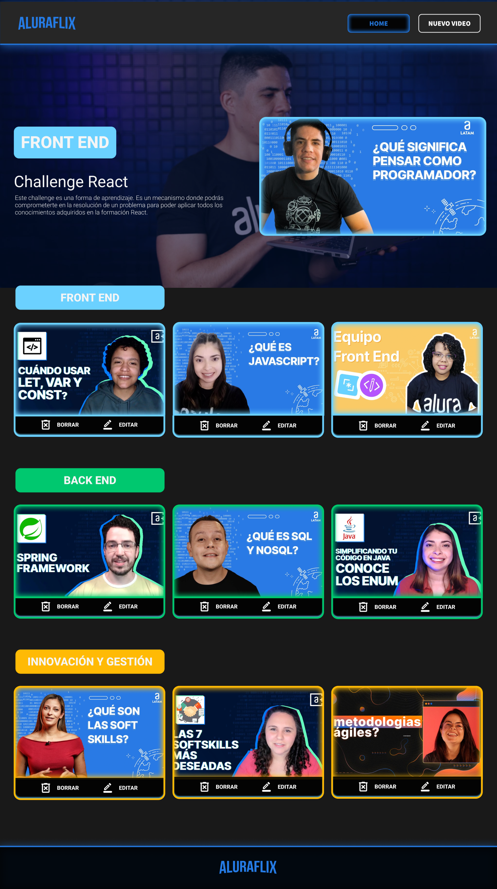
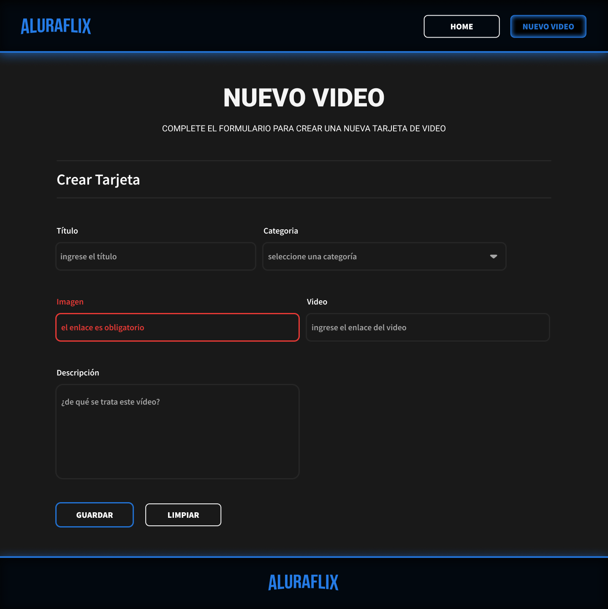

# Projecto de Alura Oracle - ONE
 > Oracle Next Education Oracle

[Clic aqui para aceeder al protótipo](https://github.com/RoberthLeal96)

<h2 align="center">Plataforma de vídeos Alura | Alura Flix</h2>

    </img>
    </img>

### Modelo Figma 
[Clic aqui para aceeder al protótipo](https://www.figma.com/design/fq7mKIvvVXYylv8eti3hjm/New-AluraFlix---ESP?node-id=1-193&t=dROnIUoH3iKPevzL-0)

### Tecnologias utilizadas
    - React
    - Next.js
    - Typescript

### para iniciar el proyecto
    - npm -d
    - npm run build
    - npm start
